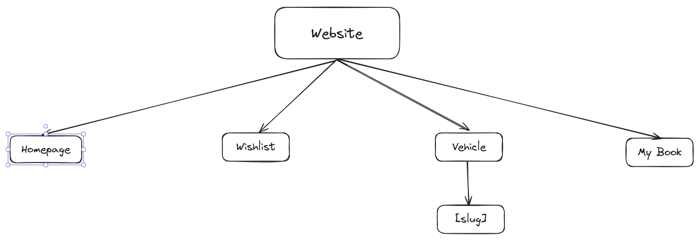

<div align="center">
  <h1>Bluebird Frontend Task</h1>
  <p>Internship Submission from Bluebird</p>
</div>

## About

- Name: Haikel Ilham Hakim
- College: ISB Atma Luhur
- Major: Informatics Engineering

## Task

> You are asked to create a basic Booking and ride cars website (single-page application) with React. We provide you with a web page wireframe to follow and the requirements for each page below. Improve this wireframe with your own design and style. You are allowed to create your own assumption but you should write it in the readme.

## Criteria

- [x] You should implement state management e.g Redux. => In this case, I use jotai instead of Redux.
- [x] You should implement react hooks useState.
- [x] You should implement react hooks useEffect.
- [x] You should implement react hooks useRef.
- [ ] You should implement unit test with Jest and Enzyme. Coverage min 50%.
- [x] You should implement a hybrid application SSR and a CSR page is a big plus.
- [ ] You should implement amp pages is a big plus.

## Structure



## Stack

In this test, I use:

- Next JS appDir for Frontend Framework.
- Typescript as main Language.
- Tailwind CSS for CSS Framework.
- Shadcn/ui for UI Components(since the deadline is only 2x24, I want to focusing more on finishing requested features).
- Jotai for State Management.
- Both SSR and CSR techniques.

## Folder Structure

```sh
├── components.json
├── next.config.js
├── package.json
├── pnpm-lock.yaml
├── postcss.config.js
├── prettier.config.js
├── public
│   └── images
├── README.md
├── src
│   ├── app
│   │   ├── favicon.ico
│   │   ├── my-book
│   │   ├── vehicle
│   │   │   └── [slug]
│   │   └── wishlist
│   ├── components
│   │   └── ui
│   │       └── typography
│   ├── features
│   ├── hooks
│   ├── lib
│   ├── store
│   └── types
├── __tests__
│   ├── home
│   ├── my-book
│   ├── search
│   ├── vehicle
│   └── wishlist
├── tsconfig.json
└── turbo.json
```

## Screenshots

Soon

## Preview

- [Website](https://bluebird-frontend-task-haikelilhamhakim.vercel.app)
- [Repository](https://github.com/haikelz/Bluebird-Frontend_Task)

## Getting Started

- Clone this repo.
- Install all deps. I use pnpm, so I can type `pnpm install`.
- After that, type `pnpm run dev` and see the result in `http://localhost:3000`
